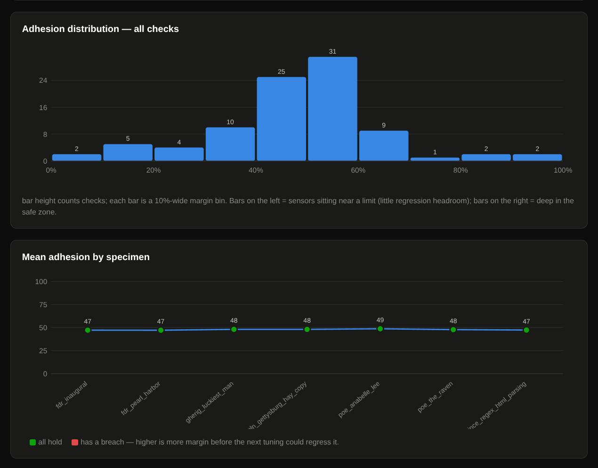

# Aldous 1_1-2.0 Research Pre-Release


_**Read The Papers (PDF):**_ [**Aldous 1-2.0 Primer**][1] |
[**Splinter (File Format & Semantic Breadboard)**][2]

Aldous `1_1-2.0` is the first (`.0` = Research/Beta) release in the Aldous 1_1-2
line of Diagnoal Emotional Covariance Estimation models (DECE).

Aldous is an open-source, zero-shot semantic telemetry and guardrail engine that
analyzes text purely through geometry, completely bypassing generative AI.
Instead of relying on unpredictable LLM reasoning or rigid string matching, it
uses Diagonal Emotional Covariance Estimation (DECE) to transform concepts into
independent multivariate Gaussian distributions. By defining emotions, intents,
and safety guardrails as stretched, elliptical boundaries in latent space,
Aldous evaluates incoming text against these curves in constant $O(1)$ time.

This approach yields precise similarity and distance floats in milliseconds,
without ever putting your text into a black box. Because it measures the
geometry of language rather than keywords, it is incredibly lightweight—capable
of training on a Chromebook and perfectly suited for high-frequency event
streams or massive, multi-part summary tasks.

Crucially, this centroid-weighted architecture unlocks Latent Concept Erasure
(LCE). Aldous can mathematically project an offending geometry—like hate speech
or toxicity—out of a text vector and re-score the residual signal to see if any
genuine, constructive meaning remains, bringing unprecented nuance to
organizational health and community moderation systems.

## 1_1-2.0 Technical specifications

Aldous is the most ambitious purely-geometric emotional valence and Trust &
Safety model that we know of (July 2026).

| Metric                  | Value              |
| ----------------------- | ------------------ |
| Graduated Dimensions    | 21                 |
| Key Sensors             | 63                 |
| Signed Indexes          | 2                  |
| Signed Key Centroids    | 10                 |
| SENSOR calls            | 82                 |
| SENSOR phrases          | 688                |
| INTRINSIC_SHUNT calls   | 2                  |
| INTRINSIC_SHUNT phrases | 26                 |
| MONOLITHIC_SHUNT calls  | 18 (1 highly-condensed phrase each) |
| Embedding passes        | 732                |
| Compiler passes         | 168                |

Stats are available via `util/dece-stats train/Aldous_1-2` from the root of the
downloaded repo.

### Variance adhesion distributions

One bar represents 10% of checks. Bars to the left have very little tolerance
left; re-tuning will likely cause them to break. Bars to the right are unlikely
to change much due to tuning. Center is better.



_Mean adhesion by specimen_ tracks how well sensors adhere across a dynamic variety of
samples; some that excite them significantly, some that just seem like noise. It's 
important that the adhesion to response remains within expected parameters for each
one.

This should be as close to uniform distribution as possible, while the top bars should
more closely resemble a Cauchy distribution for reliable broad tunability.

This model will be further harnessed and tuned in the upcoming `.1` and `.2` releases
planned over the summer.

Below is the full test run output:

<details>
  <summary>Full Adhesion Battery Run Results</summary>

```
scorer: http://127.0.0.1:3271   specimens: 7

  fdr_inaugural.txt  [ok]  mean adhesion   47%
      ✓ %markov_structural                     simi min  62.0  value   67.1  adhesion  39%
      ✓ %markov_structural                     simi max  75.0  value   67.1  adhesion  61%
      ✓ ++change_existential                   simi min  62.0  value   67.7  adhesion  44%
      ✓ ++change_existential                   simi max  75.0  value   67.7  adhesion  56%
      ✓ ++tension                              simi min  60.0  value   67.0  adhesion  47%
      ✓ ++tension                              simi max  75.0  value   67.0  adhesion  53%
      ✓ +fear                                  simi min  60.0  value   66.6  adhesion  44%
      ✓ +fear                                  simi max  75.0  value   66.6  adhesion  56%
      ✓ +fear                                  dist max  40.0  value   34.5  adhesion  14%
      ✓ ~~shunt_coercion_from_or_against_guardian simi min  25.0  value   43.9  adhesion  54%
      ✓ ~~shunt_coercion_from_or_against_guardian simi max  60.0  value   43.9  adhesion  46%
      ✓ ~~shunt_inciting_violent_action        simi min  25.0  value   63.5  adhesion  96%
      ✓ ~~shunt_inciting_violent_action        simi max  65.0  value   63.5  adhesion   4%

  fdr_pearl_harbor.txt  [ok]  mean adhesion   47%
      ✓ %markov_ev                             simi min  56.0  value   61.6  adhesion  40%
      ✓ %markov_ev                             simi max  70.0  value   61.6  adhesion  60%
      ✓ %markov_ev                             dist max  40.0  value   34.8  adhesion  13%
      ✓ %markov_partisan                       simi min  56.0  value   61.2  adhesion  37%
      ✓ %markov_partisan                       simi max  70.0  value   61.2  adhesion  63%
      ✓ ++conflict                             simi min  56.0  value   61.3  adhesion  38%
      ✓ ++conflict                             simi max  70.0  value   61.3  adhesion  62%
      ✓ ++tension                              simi min  58.0  value   63.1  adhesion  43%
      ✓ ++tension                              simi max  70.0  value   63.1  adhesion  57%
      ✓ ~~shunt_coercion_from_or_against_guardian simi min  25.0  value   47.1  adhesion  63%
      ✓ ~~shunt_coercion_from_or_against_guardian simi max  60.0  value   47.1  adhesion  37%
      ✓ ~~shunt_inciting_violent_action        simi min  25.0  value   59.9  adhesion  87%
      ✓ ~~shunt_inciting_violent_action        simi max  65.0  value   59.9  adhesion  13%

  gherig_luckiest_man.txt  [ok]  mean adhesion   48%
      ✓ %markov_ev                             simi min  63.0  value   68.5  adhesion  46%
      ✓ %markov_ev                             simi max  75.0  value   68.5  adhesion  54%
      ✓ +joy                                   simi min  62.0  value   67.2  adhesion  40%
      ✓ +joy                                   simi max  75.0  value   67.2  adhesion  60%
      ✓ +joy                                   dist max  50.0  value   37.7  adhesion  25%
      ✓ +sadness                               simi min  60.0  value   66.0  adhesion  50%
      ✓ +sadness                               simi max  72.0  value   66.0  adhesion  50%
      ✓ @Gratitude                             simi min  58.0  value   64.8  adhesion  57%
      ✓ @Gratitude                             simi max  70.0  value   64.8  adhesion  43%
      ✓ ~~shunt_coercion_from_or_against_guardian simi min  25.0  value   54.7  adhesion  85%
      ✓ ~~shunt_coercion_from_or_against_guardian simi max  60.0  value   54.7  adhesion  15%
      ✓ ~~shunt_inciting_violent_action        simi min  25.0  value   52.6  adhesion  69%
      ✓ ~~shunt_inciting_violent_action        simi max  65.0  value   52.6  adhesion  31%

  lincoln_gettysburg_hay_copy.txt  [ok]  mean adhesion   48%
      ✓ %markov_ev                             simi min  62.0  value   67.8  adhesion  45%
      ✓ %markov_ev                             simi max  75.0  value   67.8  adhesion  55%
      ✓ %markov_ev                             dist max  40.0  value   29.9  adhesion  25%
      ✓ %markov_partisan                       simi min  60.0  value   65.3  adhesion  35%
      ✓ %markov_partisan                       simi max  75.0  value   65.3  adhesion  65%
      ✓ %markov_structural                     simi min  60.0  value   65.4  adhesion  49%
      ✓ %markov_structural                     simi max  71.0  value   65.4  adhesion  51%
      ✓ ++joy                                  simi min  60.0  value   65.6  adhesion  47%
      ✓ ++joy                                  simi max  72.0  value   65.6  adhesion  53%
      ✓ ~~shunt_coercion_from_or_against_guardian simi min  25.0  value   47.5  adhesion  64%
      ✓ ~~shunt_coercion_from_or_against_guardian simi max  60.0  value   47.5  adhesion  36%
      ✓ ~~shunt_inciting_violent_action        simi min  25.0  value   64.2  adhesion  98%
      ✓ ~~shunt_inciting_violent_action        simi max  65.0  value   64.2  adhesion   2%

  poe_anabelle_lee.txt  [ok]  mean adhesion   49%
      ✓ %markov_ev                             simi min  58.0  value   63.6  adhesion  47%
      ✓ %markov_ev                             simi max  70.0  value   63.6  adhesion  53%
      ✓ %markov_ev                             dist max  50.0  value   33.5  adhesion  33%
      ✓ +sadness                               simi min  56.0  value   61.9  adhesion  49%
      ✓ +sadness                               simi max  68.0  value   61.9  adhesion  51%
      ✓ +spirituality                          simi min  57.0  value   62.8  adhesion  45%
      ✓ +spirituality                          simi max  70.0  value   62.8  adhesion  55%
      ✓ +tension                               simi min  54.0  value   60.3  adhesion  39%
      ✓ +tension                               simi max  70.0  value   60.3  adhesion  61%
      ✓ ~~shunt_coercion_from_or_against_guardian simi min  25.0  value   51.4  adhesion  75%
      ✓ ~~shunt_coercion_from_or_against_guardian simi max  60.0  value   51.4  adhesion  25%
      ✓ ~~shunt_inciting_violent_action        simi min  25.0  value   48.8  adhesion  60%
      ✓ ~~shunt_inciting_violent_action        simi max  65.0  value   48.8  adhesion  41%

  poe_the_raven.txt  [ok]  mean adhesion   48%
      ✓ %markov_ev                             simi min  56.0  value   61.8  adhesion  41%
      ✓ %markov_ev                             simi max  70.0  value   61.8  adhesion  59%
      ✓ %markov_ev                             dist max  40.0  value   31.4  adhesion  21%
      ✓ +fear                                  simi min  54.0  value   60.0  adhesion  50%
      ✓ +fear                                  simi max  66.0  value   60.0  adhesion  50%
      ✓ +sadness                               simi min  51.0  value   56.9  adhesion  42%
      ✓ +sadness                               simi max  65.0  value   56.9  adhesion  58%
      ✓ +tension                               simi min  54.0  value   59.6  adhesion  35%
      ✓ +tension                               simi max  70.0  value   59.6  adhesion  65%
      ✓ ~~shunt_coercion_from_or_against_guardian simi min  25.0  value   44.2  adhesion  55%
      ✓ ~~shunt_coercion_from_or_against_guardian simi max  60.0  value   44.2  adhesion  45%
      ✓ ~~shunt_inciting_violent_action        simi min  25.0  value   45.8  adhesion  52%
      ✓ ~~shunt_inciting_violent_action        simi max  65.0  value   45.8  adhesion  48%

  stackoverflow_bobince_regex_html_parsing.txt  [ok]  mean adhesion   47%
      ✓ %markov_ev                             simi min  46.0  value   51.9  adhesion  42%
      ✓ %markov_ev                             simi max  60.0  value   51.9  adhesion  58%
      ✓ %markov_ev                             dist max  50.0  value   42.1  adhesion  16%
      ✓ %markov_structural                     simi min  46.0  value   51.8  adhesion  48%
      ✓ %markov_structural                     simi max  58.0  value   51.8  adhesion  52%
      ✓ @Reactionary                           simi min  43.0  value   49.0  adhesion  50%
      ✓ @Reactionary                           simi max  55.0  value   49.0  adhesion  50%
      ✓ @Sarcasm                               simi min  43.0  value   48.2  adhesion  43%
      ✓ @Sarcasm                               simi max  55.0  value   48.2  adhesion  57%
      ✓ ~~shunt_coercion_from_or_against_guardian simi min  25.0  value   40.3  adhesion  44%
      ✓ ~~shunt_coercion_from_or_against_guardian simi max  60.0  value   40.3  adhesion  56%
      ✓ ~~shunt_inciting_violent_action        simi min  25.0  value   46.3  adhesion  53%
      ✓ ~~shunt_inciting_violent_action        simi max  65.0  value   46.3  adhesion  47%

report: sensor-report.html

summary: 7 scored, 0 failing check(s), peak adhesion 98%
```
</details>

_**[The Full Generated HTML Report][4]**_ Is included in
`train/tests/release-benchmarks/`.

(More samples coming in the `.1` release)

## Known Limitations

While Aldous demonstrates amazing consistency and accuracy across a wide variety
of well-known samples, there are things to understand:

- You are limited to the embedder context window (typically small, 8-32k), so
  you have to use TKM on a dedicated GPU for an emotional summary of a long
  novel. Whereas, if you were sampling a live event every 30 seconds and
  analyzing it as a large JSONL series, you'd use something like a leaky
  integrator. _**tl;dr: doing seemingly orinary things with semantic analysis
  requires math.**_ Not hard math, but there's more to it than adding up the
  parts.

- Mean-pooled monolithic shunts are not meant to trigger automation; they are
  meant to trigger further review. "Strange Fruit" by Billie Holiday will
  trigger on the presence of anti-Black and anti-Romani sentiment. That doesn't
  make the words objectionable content.

- Semantic models are meant for use in settings where _**you want to give
  receipts**_. One of their most compelling features is the ability for
  community moderation or infosec teams to be able to quickly find out when new
  concepts start flying around their communication spaces. Theyr'e specifically
  designed to not be fooled by simply turning phrases or changing strings. The
  incentive for participation is a lack of surprise or "opperession" by the
  system that's supposed to be keeping people safe. If and "open" system doesn't
  explain itself, it feels like a Trojan horse. Aldous' primary goals surround
  putting governance back in the hands of the people that are vulnerable to
  these systems.

- More coverage is needed by the included test harness. This is planned for the
  `.1` release when more samples are also available. Until then, a limited
  number of keys are being tracked for limit adhesion.

## Aldous fills a gap for LLMs

Aldous helps LLMs know how their output is likley going to be felt. This
includes sensors for both Human and synthethic sycophancy. Detection requires
brutal honesty, which is why Aldous does it purely with math.

But you can't "semantically-self-analyze" something, and even though Aldous
classifies things with stunning accuracy, AI reasoning spot patterns fast, just
like in medical imaging. LLMs should never be used for emotional
classifications, but interpreting them? With solid training, it opens many
possibilities.

In the future, Aldous_1-x.gguf as a companion instruct model that can examine
flagged specimens for human escalation, or just help narrate the results of
analysis, is on the roadmap. It will be a highly-adapted tuning of a Qwen (7B or
below) model, or possibly a fewer paramater but more ambitiously-trained
3B-instruct.

Auditing and narration are first.

## What are the DECE format and `semsage` tools?

Semsage is a collection of Tools and services for the lifecycle of **DECE
models** — semantic classifiers that score text against a set of centroid
sensors. Aldous is a DECE (prounounced _dee see_) model, and `semsage` provides
the harness to use it.

A DECE model is multiple parts: a compiled Splinter store; a local or remote
embedder and a diagonal covariance (estimated Mahalanobis) scoring system that
understands the relationship between semantic pre-populated centroid-weighted
emotional valence concepts and the specimen text being examined.

Models are best explored through a web-based visualizer that shows not just the
diagonal intensity spread, but also the individual sensors as input signals that
change dynamically.

`semsage` is the single command that ties it together: it wires the install into
systemd, raises the shared-memory bus the embedder and scorer talk over, starts
and stops the per-model services, and fine-tunes individual keys.

Models carry an explicit type suffix that is **never inferred** — you always
pass it. A `.dece` model named `Aldous_1-2` lives at
`dece/Aldous_1-2/Aldous_1-2.dece`, and you refer to it as `Aldous_1-2.dece`.

## Training or downloading Aldous (DO THIS SECOND)

The scorer needs a compiled `.dece` model to serve. `util/install_splinter`
checks `dece/` at the end and, if it's empty, points you at the two ways to get
the reference model **Aldous_1-2** (embedded with Nomic Text 1.5). Run either
from the project root, once you have gotten through step 6 of the quick start.

**1. Train it yourself** — takes ~15 minutes on a typical laptop, and you get to
watch it build. (_**First, do steps 1-6 of the quick start below, then return
here.**_):

```sh
util/install_nomic        # once, if you haven't fetched the embedder model yet
train/Aldous_1-2          # compiles dece/Aldous_1-2/Aldous_1-2.dece
```

**2. Download the pre-trained binary** — ready to use immediately; verify the
checksum after decompressing if you wish (you can do this at any time, even as
other things build):

```sh
mkdir -p dece/Aldous_1-2
curl -fL -o dece/Aldous_1-2/Aldous_1-2.dece.xz \
    https://annex.foreshock.io/bin/models/aldous/1-2/Aldous_1-2.dece.xz
curl -fL -o dece/Aldous_1-2/Aldous_1-2.dece.sha256 \
    https://annex.foreshock.io/bin/models/aldous/1-2/Aldous_1-2.dece.sha256
xz -d dece/Aldous_1-2/Aldous_1-2.dece.xz
```

Either way you end up with `dece/Aldous_1-2/Aldous_1-2.dece`, ready for
`semsage uplink Aldous_1-2.dece`. How you get there is up to how fast your
computer is and how much time you have to spend.

## Quick start (fresh Debian/Ubuntu) (DO THIS FIRST)

Assumes a clean machine with `sudo`. Every step below is needed the first time.

```sh
# 1. Get the source tree.
git clone <your-fork-url> semsage
cd semsage

# 2. Install the full toolchain: system packages, llama.cpp, and libsplinter.
#    Interactive — it asks before each sudo step, and takes a few minutes.
util/install_splinter

# 3. Fetch the embedding model (nomic-embed-text v1.5 -> gguf/nomic.gguf).
util/install_nomic

# 4. Build the scoring gateway (-> app/inf/dece-semsaged).
make -C app/inf

# 5. Wire semsage into your systemd user session. Nothing is started yet.
util/semsage install

# 6. Optional: put semsage on your PATH (it still finds its install root).
ln -s "$PWD/util/semsage" ~/.local/bin/semsage

#
# 7 - GO GET ALDOUS (train it or download it)
#

# 8. Bring Aldous up. If dece/ is empty, see "Training or obtaining Aldous"
semsage uplink Aldous_1-2.dece    # raise the shared-memory bus
semsage enable Aldous_1-2.dece    # start on login
semsage start  Aldous_1-2.dece    # start now
semsage status Aldous_1-2.dece

# 8. Explore in the browser
semsage visualize
```

## Getting Involved / Contributing / Reporting Issues

Use the Github facilities for now. The
[company behind Aldous](https://foreshock.io) is in the midst of a rather large
launch on their end; We'll have a Discord server up as soon as we can
responsibly keep an eye on it.

Github is the best place for things to not get lost right now.

## Foundations & Acknowledgements

Aldous is Free Software under the terms of the Apache 2 software license, where
applicable, or CC-0 where the content is prosaic, not code, and not describing
the creation of code. The vector substrate and file system backing Aldous, which
is named Splinter, is also free software under the terms of the Apache 2
software license.

Unless otherwise explicitly marked, supporting code, scripts and utilities are
released under the terms of the MIT software license, with all documentation and
other creatives under the terms of CC-0.

Aldous comes with no warranty or guarantee of suitability for any purpose.

### Infrastructure

Aldous does not run on its own. It needs somewhere to keep vectors, key-value
state, relation graphs, epoch counters, atomics, and an embedded scripting
runtime, all in a footprint small enough to sit on whatever hardware it is
handed. That substrate is Splinter (Post, 2026), a lock-free shared-memory
manifold that holds every one of those things with no database server and no
socket in the path. To Splinter, DECE is only one pose it can hold: the engine
that does Aldous' emotional scoring is, from the substrate's point of view, a
single arrangement of slots and vectors among the many it could carry. That
generality is why Aldous can be as light as it is. None of the machinery it
leans on had to be built into it.

The same substrate is also why Aldous is not bounded by the hardware it can
train on. Because a governing process can read the same physical memory an
inference engine writes into, the observation gap that forces most oversight to
happen after the fact closes as a property of the address space rather than as a
matter of policy. On larger hardware, that is what lets Aldous observe
generation while it is still in flight, at a latency and scale the
single-machine framing understates. We link to the Splinter thesis rather than
restate it here, but the ceiling it raises for this kind of work sits well above
the modest hardware floor it advertises.

### Mathematics

Aldous does not introduce new math; it reimagines settled, peer-reviewed ideas
and aims them at a problem they were not originally built for: fast, honest
emotional and intent telemetry. Its scoring rule is a variance-scaled distance
from a specimen to a concept's centroid, which is the diagonal case of the
Mahalanobis distance (Mahalanobis, 1936) and a close relative of the diagonal
discriminant classifiers and nearest-shrunken-centroid methods that
statisticians refined for high-dimensional data (Fisher, 1936; Dudoit et al.,
2002; Tibshirani et al., 2002; Bickel & Levina, 2004). What Aldous adds is the
embedder: it computes those centroids and variances over independently embedded
phrases rather than raw features, which is the same technique the few-shot
learning community applied with matching, prototypical, and
Gaussian-prototypical networks (Vinyals et al., 2016; Snell et al., 2017; Fort,
2017).

We don't state the lineage defensively other than to state that Aldous' design
is based on very grounded, accepted, published and peer-reviewed research.
Aldous' returned responses are the result of measurements that other people have
studied and validated independently across decades. We aren't changing
measurements; we're just applying them to a different, perhaps unconventional,
class of problem.

Aldous' most exciting trust & safety features are also not new art: Latent
Concept Erasure is the smallest, single-direction case of linear concept
erasure, a technique the interpretability community has developed with real
rigor (Ravfogel et al., 2020, 2022; Belrose et al., 2023). Aldous applies it to
re-scoring rather than debiasing, but the geometry is theirs. Furthermore, the
tolerance harness that gates every release is behavioral testing in the
tradition of CheckList (Ribeiro et al., 2020), carried into trust and safety,
where reproducible receipts matter themost.

Their work matters every bit as much as Aldous' core mission to remain
transparent, deterministic and auditable. We are glad to build in the open on
foundations that were shared with so much care and respect for our collective
sum of knowledge.

The references below are here so that anyone can follow a claim back to its
source.

## References

### Scoring, distance, and few-shot prototypes

Bickel, P. J., & Levina, E. (2004). Some theory for Fisher's linear discriminant
function, "naive Bayes," and some alternatives when there are many more
variables than observations. _Bernoulli_, 10(6), 989–1010.

Dudoit, S., Fridlyand, J., & Speed, T. P. (2002). Comparison of discrimination
methods for the classification of tumors using gene expression data. _Journal of
the American Statistical Association_, 97(457), 77–87.

Fisher, R. A. (1936). The use of multiple measurements in taxonomic problems.
_Annals of Eugenics_, 7(2), 179–188. (Journal now published as _Annals of Human
Genetics_.)

Fort, S. (2017). Gaussian prototypical networks for few-shot learning on
Omniglot. _arXiv:1708.02735_. Bayesian Deep Learning Workshop, NIPS 2017.

Mahalanobis, P. C. (1936). On the generalised distance in statistics.
_Proceedings of the National Institute of Sciences of India_, 2, 49–55.

Snell, J., Swersky, K., & Zemel, R. (2017). Prototypical networks for few-shot
learning. _Advances in Neural Information Processing Systems (NeurIPS)_ 30.
_arXiv:1703.05175_.

Tibshirani, R., Hastie, T., Narasimhan, B., & Chu, G. (2002). Diagnosis of
multiple cancer types by shrunken centroids of gene expression. _Proceedings of
the National Academy of Sciences (PNAS)_, 99(10), 6567–6572.

Vinyals, O., Blundell, C., Lillicrap, T., Kavukcuoglu, K., & Wierstra, D.
(2016). Matching networks for one shot learning. _Advances in Neural Information
Processing Systems (NeurIPS)_ 29, 3630–3638. _arXiv:1606.04080_.

### Concept erasure

Belrose, N., Schneider-Joseph, D., Ravfogel, S., Cotterell, R., Raff, E., &
Biderman, S. (2023). LEACE: Perfect linear concept erasure in closed form.
_Advances in Neural Information Processing Systems (NeurIPS)_ 36.
_arXiv:2306.03819_. Code: github.com/EleutherAI/concept-erasure.

Ravfogel, S., Elazar, Y., Gonen, H., Twiton, M., & Goldberg, Y. (2020). Null it
out: Guarding protected attributes by iterative nullspace projection.
_Proceedings of the 58th Annual Meeting of the Association for Computational
Linguistics (ACL)_, 7237–7256. _arXiv:2004.07667_.

Ravfogel, S., Twiton, M., Goldberg, Y., & Cotterell, R. (2022). Linear
adversarial concept erasure. _Proceedings of the 39th International Conference
on Machine Learning (ICML)_, PMLR 162, 18400–18421.

### Behavioral testing

Ribeiro, M. T., Wu, T., Guestrin, C., & Singh, S. (2020). Beyond accuracy:
Behavioral testing of NLP models with CheckList. _Proceedings of the 58th Annual
Meeting of the Association for Computational Linguistics (ACL)_, 4902–4912.
_arXiv:2005.04118_.

### Infrastructure

Post, Timothy L. (2026). Splinter: A Lock-Free Shared-Memory Substrate For
Tightly-Coupled Inference And Governance. _Open Source Vector Substrate_
@splinterhq/libsplinter (Github).
https://splinterhq.github.io/splinter_thesis.pdf (Thesis).

[1]: https://annex.foreshock.io/bin/models/aldous/1-2/Aldous_1-2.0.pdf
[2]: https://splinterhq.github.io/splinter_thesis.pdf
[3]: https://foreshock.io
[4]: https://annex.foreshock.io/bin/models/aldous/1-2/sensor-benchmarks.html
